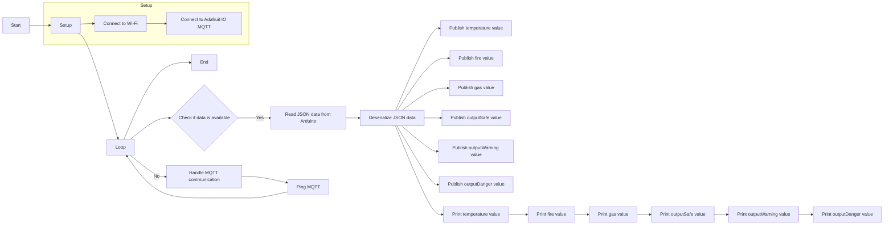

# explanation 

```
#include <ESP8266WiFi.h>
#include <SoftwareSerial.h>
#include <Adafruit_MQTT_Client.h>
#include <ArduinoJson.h>
```

- The code includes the necessary libraries for the ESP8266 WiFi module, SoftwareSerial communication, Adafruit MQTT Client, and ArduinoJson.

```
#define SOFT_SERIAL_RX_PIN D2
#define SOFT_SERIAL_TX_PIN D3
```

- The code defines the pins for the SoftwareSerial communication, used to communicate with another Arduino device.

```
const char* ssid = "pixel";
const char* password = "drowssap";
```

- The code defines the SSID (Wi-Fi network name) and password for connecting to the Wi-Fi network.

```
#define AIO_SERVER "io.adafruit.com"
#define AIO_SERVERPORT 1883
#define AIO_USERNAME "YOUR_AIO_USERNAME"
#define AIO_KEY "YOUR_AIO_KEY"
```

- The code defines the Adafruit IO MQTT server, server port, Adafruit IO username, and API key.

```
WiFiClient client;
Adafruit_MQTT_Client mqtt(&client, AIO_SERVER, AIO_SERVERPORT, AIO_USERNAME, AIO_USERNAME, AIO_KEY);
SoftwareSerial softSerial(SOFT_SERIAL_RX_PIN, SOFT_SERIAL_TX_PIN);  // RX, TX
```

- The code creates instances of the WiFiClient, Adafruit_MQTT_Client, and SoftwareSerial classes.

```
Adafruit_MQTT_Publish temp(&mqtt, AIO_USERNAME "/feeds/test.temperature");
Adafruit_MQTT_Publish fire(&mqtt, AIO_USERNAME "/feeds/test.fire");
Adafruit_MQTT_Publish gas(&mqtt, AIO_USERNAME "/feeds/test.gas");
Adafruit_MQTT_Publish outputSafe(&mqtt, AIO_USERNAME "/feeds/test.output-safe");
Adafruit_MQTT_Publish outputWarning(&mqtt, AIO_USERNAME "/feeds/test.output-warning");
Adafruit_MQTT_Publish outputDanger(&mqtt, AIO_USERNAME "/feeds/test.output-danger");
```

- The code creates Adafruit_MQTT_Publish instances for publishing MQTT messages to specific topics on Adafruit IO.

```
void setup() {
  Serial.begin(115200);
  softSerial.begin(115200);  // Set the baud rate of your Arduino

  connectToWiFi();
  connectToMQTT();
}
```

- The code defines the `setup()` function where the initialization tasks are performed.
- Serial communication is started with a baud rate of 115200.
- SoftwareSerial communication is started with a baud rate of 115200.
- It calls the `connectToWiFi()` function to connect to the Wi-Fi network.
- It calls the `connectToMQTT()` function to connect to the Adafruit IO MQTT server.

```
void loop() {
  if (softSerial.available()) {
    String jsonStr = softSerial.readStringUntil('\n'); // Read JSON data from Arduino
    deserializeAndPublish(jsonStr);
    Serial.println(jsonStr);
  }

  mqtt.processPackets(100);
  mqtt.ping();
}
```

- The code defines the `loop()` function where the main tasks are performed in a continuous loop.
- It checks if there is data available on the SoftwareSerial communication.
- If data is available, it reads a JSON string from the SoftwareSerial and calls the `deserializeAndPublish()` function to process and publish the JSON data.
- It also prints the received JSON string over the Serial communication.
- It calls the `processPackets()` function of the Adafruit_MQTT_Client to handle MQTT communication.
- It calls the `ping()` function of the Adafruit_MQTT_Client to keep the MQTT connection alive.

```
void connectToWiFi() {
  WiFi.begin(ssid, password);
  Serial.print("Connecting to WiFi...");
  while (WiFi.status() != WL_CONNECTED) {
    delay(1000);
    Serial.println("Connecting to WiFi...");
  }
  Serial.println("Connected to WiFi");
}
```

- The code defines the `connectToWiFi()` function that connects the device to the Wi-Fi network.
- It calls `WiFi.begin()` with the specified SSID and password to initiate the connection.
- It enters a loop and waits until the device is connected to the Wi-Fi network by checking the `WiFi.status()`.
- Inside the loop, it prints "Connecting to WiFi..." and waits for 1 second before checking the status again.
- Once the device is connected, it prints "Connected to WiFi" and returns.

```
void connectToMQTT() {
  int8_t ret;

  Serial.print("Connecting to MQTT... ");

  while ((ret = mqtt.connect()) != 0) {
    Serial.println(mqtt.connectErrorString(ret));
    Serial.println("Retrying MQTT connection in 5 seconds...");
    mqtt.disconnect();
    delay(5000);
  }

  Serial.println("MQTT connected!");
}
```

- The code defines the `connectToMQTT()` function that connects the device to the Adafruit IO MQTT server.
- It initializes an int8_t variable ret to store the connection result.
- It prints "Connecting to MQTT..." to indicate the connection process.
- It enters a loop and attempts to connect to the MQTT server using `mqtt.connect()`.
- If the connection is successful (ret = 0), it breaks out of the loop and prints "MQTT connected!".
- If the connection fails, it prints the connection error message using `mqtt.connectErrorString(ret)`.
- It then prints "Retrying MQTT connection in 5 seconds...", disconnects from the MQTT server, and waits for 5 seconds before retrying the connection.

```
void deserializeAndPublish(const String& jsonStr) {
  DynamicJsonDocument jsonDoc(256);
  DeserializationError error = deserializeJson(jsonDoc, jsonStr);

  if (error) {
    Serial.print("deserializeJson() failed: ");
    Serial.println(error.f_str());
    return;
  }

  float temperatureValue = jsonDoc["t"].as<float>();
  float fireValue = jsonDoc["f"].as<float>();
  float gasValue = jsonDoc["g"].as<float>();
  float safeValue = jsonDoc["s"].as<float>();
  float warningValue = jsonDoc["w"].as<float>();
  float dangerValue = jsonDoc["d"].as<float>();

  publishValue(temp, temperatureValue);
  publishValue(fire, fireValue);
  publishValue(gas, gasValue);
  publishValue(outputSafe, safeValue);
  publishValue(outputWarning, warningValue);
  publishValue(outputDanger, dangerValue);

  printSensorData("Temp", temperatureValue);
  printSensorData("Fire", fireValue);
  printSensorData("Gas", gasValue);
  printSensorData("Safe", safeValue);
  printSensorData("Warning", warningValue);
  printSensorData("Danger", dangerValue);
}
```

- The code defines the `deserializeAndPublish()` function that processes and publishes the received JSON data.
- It creates a DynamicJsonDocument with a capacity of 256 bytes to store the parsed JSON.
- It calls `deserializeJson()` to parse the jsonStr and checks if there is any error.
- If there is an error, it prints the error message and returns.
- It retrieves the values of different sensors from the parsed JSON using the key names "t", "f", "g", "s", "w", and "d".
- It calls the `publishValue()` function for each sensor value to publish it to the corresponding MQTT topic.
- It calls the `printSensorData()` function for each sensor value to print it over the Serial communication.

```
void publishValue(Adafruit_MQTT_Publish& feed, float value) {
  if (!feed.publish(value)) {
    Serial.println("Failed to publish data to MQTT topic");
  }
}
```

- The code defines the `publishValue()` function that publishes a float value to the specified MQTT feed/topic.
- It takes an `Adafruit_MQTT_Publish` object feed and a float value as parameters.
- It attempts to publish the value to the MQTT topic using the `feed.publish()` function.
- If the publish operation fails, it prints "Failed to publish data to MQTT topic" over the Serial communication.

```
void printSensorData(const char* sensorName, float value) {
  Serial.print(sensorName);
  Serial.print(": ");
  Serial.println(value);
}
```

- The code defines the `printSensorData()` function that prints the sensor name and its corresponding value over the Serial communication.
- It takes a const char* sensorName and a float value as parameters.
- It prints the sensor name, followed by a colon and space, and then prints the value on a new line using `Serial.println()`.

## flowchart 


