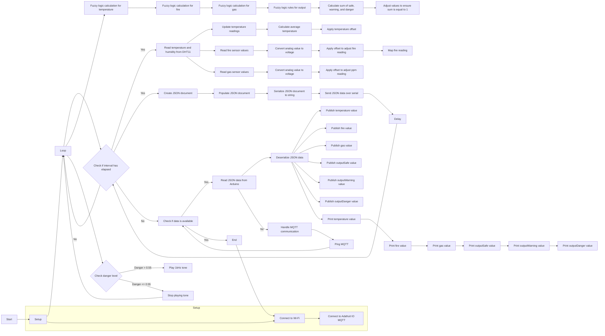

# final / finished code

## flowcharts 

```mermaid
graph LR
A[Start] --> B[Setup]
B --> C[Loop]
C --> D{Check if interval has elapsed}
D -- Yes --> E[Read temperature and humidity from DHT11]
E --> F[Update temperature readings]
F --> G[Calculate average temperature]
G --> H[Apply temperature offset]
E --> I[Read fire sensor values]
I --> J[Convert analog value to voltage]
J --> K[Apply offset to adjust fire reading]
K --> L[Map fire reading]
E --> M[Read gas sensor values]
M --> N[Convert analog value to voltage]
N --> O[Apply offset to adjust ppm reading]
C --> P[Fuzzy logic calculation for temperature]
P --> Q[Fuzzy logic calculation for fire]
Q --> R[Fuzzy logic calculation for gas]
R --> S[Fuzzy logic rules for output]
S --> T[Calculate sum of safe, warning, and danger]
T --> U[Adjust values to ensure sum is equal to 1]
D -- No --> C
C --> V{Check danger level}
V -- Danger > 0.55 --> W[Play 1kHz tone]
V -- Danger <= 0.55 --> X[Stop playing tone]
X --> C
D -- Yes --> Y[Create JSON document]
Y --> Z[Populate JSON document]
Z --> AA[Serialize JSON document to string]
AA --> AB[Send JSON data over serial]
AB --> AC[Delay]
AC --> D
D -- No --> AD[Check if data is available]
AD -- Yes --> AE[Read JSON data from Arduino]
AE --> AF[Deserialize JSON data]
AF --> AG[Publish temperature value]
AF --> AH[Publish fire value]
AF --> AI[Publish gas value]
AF --> AJ[Publish outputSafe value]
AF --> AK[Publish outputWarning value]
AF --> AL[Publish outputDanger value]
AF --> AM[Print temperature value]
AM --> AN[Print fire value]
AN --> AO[Print gas value]
AO --> AP[Print outputSafe value]
AP --> AQ[Print outputWarning value]
AQ --> AR[Print outputDanger value]
AE -- No --> AS[Handle MQTT communication]
AS --> AT[Ping MQTT]
AT --> AD
AD -- Yes --> AU[End]
AU --> AV[Stop]

subgraph Setup
  B --> AV[Connect to Wi-Fi]
  AV --> AW[Connect to Adafruit IO MQTT]
end
```
